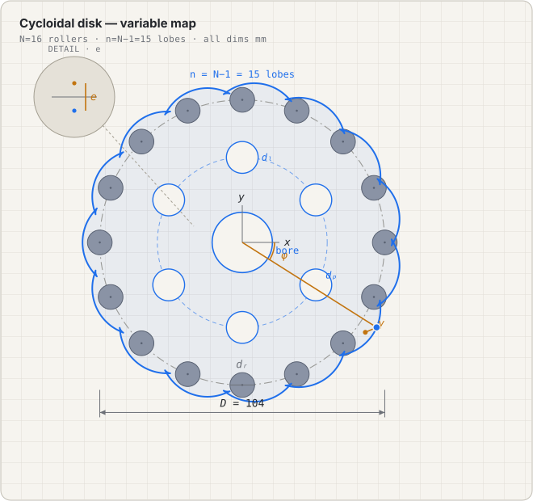

# Cycloidal Drive FeatureScript

A custom [Onshape](https://www.onshape.com/) FeatureScript that generates a complete **cycloidal reducer disk** from first principles — the lobed cycloidal profile, the eccentric center bore, and the load-pin holes — as one parametric, fully-associative feature that rebuilds cleanly at any drive ratio.

A cycloidal disk is the heart of a cycloidal reducer, but its lobed profile is a true cycloid: painful to draw by hand, and standard sketches don't regenerate correctly when the roller count or eccentricity changes. This feature treats the reducer geometry as equations rather than sketches.

## Variable model

Every symbol below is a real piece of geometry. This diagram and table are the **canonical reference** — the FeatureScript, the write-ups, and the [interactive model](https://claude.ai/code/artifact/410c5f86-24bf-4eaa-a3c0-0745b7571e4a) all use these exact names, so anyone documenting the drive should too.



> **Interactive version:** [Cycloidal Disk Anatomy](https://claude.ai/code/artifact/410c5f86-24bf-4eaa-a3c0-0745b7571e4a) — drag any parameter and hover a variable to see exactly what it controls.

### Profile variables (drive the contour)

| Symbol | Name | What it controls |
|--------|------|------------------|
| `D` | Roller pitch-circle diameter | Diameter of the circle the roller centers sit on; sets overall disk size. |
| `dᵣ` | Roller diameter | Diameter of each roller/pin; offsets the contour inward by the roller radius. |
| `N` | Number of rollers | Rollers in the ring gear. Fixes the reduction: the disk grows **n = N − 1** lobes. |
| `n` | Lobe count | `n = N − 1`, always one fewer than the rollers — that's what makes the disk walk one tooth per input turn. |
| `e` | Eccentricity | Offset between the input-shaft center and the disk center. Sets lobe depth and the reduction ratio `1 : n`. |
| `φ` | Sweep parameter | The curve parameter, `0 … 2π`; traces the whole profile. |
| `γ` | Contact / offset angle | Auxiliary angle that aims the roller-radius offset. Evaluated with `atan2` (see note below). |

### Feature variables (the rest of the disk)

| Symbol | Name | What it controls |
|--------|------|------------------|
| `dₚ` | Load-hole pitch diameter | Pitch circle the output-pin holes ride on. |
| `dₗ` | Load-pin diameter | Output-pin size; each hole is bored `dₗ + 2e` so the pins clear the eccentric motion. |
| `hc` | Load-hole count | Number of output-pin holes driving the output shaft. |
| `bore` | Center bore diameter | Seat for the eccentric input bearing at the disk center. |
| `depth` | Extrusion thickness | Disk thickness along Z. |

## The profile equation

The finished disk contour, expressed directly from the roller geometry (`n = N − 1` lobes):

```
γ = atan2( sin((N−1)·φ),  cos((N−1)·φ) − D / (2·e·N) )

x =  D/2 · cos(φ) − dᵣ/2 · cos(φ + γ) − e · cos(N·φ)
y = −D/2 · sin(φ) + dᵣ/2 · sin(φ + γ) + e · sin(N·φ)
```

`γ` is written as `tan⁻¹(…)` in most references, but it must be evaluated as **`atan2(numerator, denominator)`**: the denominator `cos((N−1)φ) − D/(2eN)` goes negative over part of the revolution, and a single-argument arctangent would land in the wrong quadrant and flip the contour. Same math, correct across the full `0 … 2π` sweep.

> **Note on the earlier formulation.** An earlier version of this feature traced the roller-**center** reference path from a base circle `d` and a rolling circle `delta` (`ratio = d / delta`), which you then offset by the roller radius by hand. That path is kept, commented out, in [`cycloidal-drive.fs`](./cycloidal-drive.fs) for reference; the equation above supersedes it by deriving the finished contour in one step.

## How it works

1. **Profile** — sweeps the equation above over `φ = 0 … 2π` (sampled finely enough to resolve every lobe) and fits a periodic spline.
2. **Center bore** — a concentric circle for the eccentric input shaft.
3. **Load-pin holes** — `hc` circles on the `dₚ` pitch circle; each hole is enlarged by `2·e` so the pins clear the disk's eccentric motion.
4. **Extrude** — the solved sketch region is extruded to `depth`, producing the finished disk in one feature.

Because the lobe count is derived as `N − 1` and every hole is placed parametrically, changing a single drive parameter regenerates the entire disk correctly.

## Usage

Copy the contents of [`cycloidal-drive.fs`](./cycloidal-drive.fs) into a Feature Studio in Onshape (built against the `onshape/std` version pinned at the top of the file), then add the **Cycloidal Path** custom feature to a Part Studio.

## License

MIT
